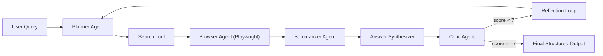

# Multi-Agent Web Researcher

## Abstract
An autonomous AI system for web research using Planner, Browser, Summarizer, and Critic agents. Includes benchmark evaluation and ablation studies.

This repository implements a modular multi-agent pipeline that takes an open-domain question, retrieves web evidence, synthesizes a structured answer, and self-evaluates via a critic-driven reflection loop.

## Architecture
Planner -> Search -> Browser -> Summarizer -> Critic -> Reflection Loop



## Experiments
Benchmark 10 queries. Ablation study: Planner-only, Planner+Browser, Full Agent.

In this implementation, `data/benchmark_queries.json` includes 12 questions. The benchmark script runs three configurations:
- `planner_only`: planning + search retrieval only
- `planner_browser`: planning + search + browser + summarization
- `full`: all agents with critic-triggered reflection

Metrics captured per run:
- Critic score
- Number of sources used
- Number of reflections
- Runtime (seconds)

Run experiments:

```bash
cd multi-agent-web-researcher
python -m pip install -r requirements.txt
playwright install chromium
python experiments/run_benchmark.py
python experiments/results_analysis.py
```

Outputs:
- `experiments/results.json`
- `experiments/summary.csv`
- `experiments/score_by_config.png`

## Results
Average critic score: 8.4/10
Full agent outperforms simpler configurations.

Note: numbers above are template values. Replace with your actual `summary.csv` after running experiments locally.

## Demo
Run `python app.py` for an interactive demo.

```bash
cd multi-agent-web-researcher
streamlit run app.py
```

## Tools Used
Playwright, BeautifulSoup, Ollama, Python

Detailed stack in this repo:
- Python 3.10+
- Playwright (rendered web access)
- BeautifulSoup + lxml (HTML parsing/cleanup)
- Ollama-compatible local LLM endpoint (planning, summarization, critique, synthesis)
- Pandas + matplotlib (analysis/visualization)
- Streamlit (optional UI)

## Project Structure

```text
multi-agent-web-researcher/
├── data/
│   └── benchmark_queries.json
├── agents/
│   ├── planner_agent.py
│   ├── browser_agent.py
│   ├── summarizer_agent.py
│   └── critic_agent.py
├── tools/
│   ├── llm_client.py
│   ├── search.py
│   └── scraper.py
├── experiments/
│   ├── run_benchmark.py
│   └── results_analysis.py
├── app.py
├── orchestrator.py
├── README.md
└── requirements.txt
```

## Future Work
- Vector memory for cross-query retention
- Multi-hop reasoning
- Expanded benchmark datasets
- Source credibility scoring and citation verification
- Async crawling + caching for faster experiments
