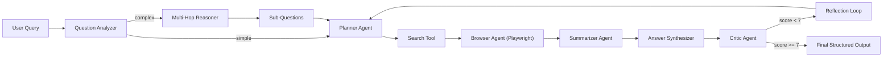

# Multi-Agent Web Researcher

## Abstract
An autonomous AI system for web research using Planner, Browser, Summarizer, and Critic agents. Includes multi-hop reasoning for complex questions, benchmark evaluation, and ablation studies.

This repository implements a modular multi-agent pipeline that takes an open-domain question, retrieves web evidence, synthesizes a structured answer, and self-evaluates via a critic-driven reflection loop. For complex multi-step questions, it decomposes them into sub-questions and chains reasoning together.

## Architecture
Planner -> Search -> Browser -> Summarizer -> Critic -> Reflection Loop

With multi-hop reasoning for complex questions:



## Multi-Hop Reasoning
The system now automatically detects complex questions requiring multi-step reasoning and handles them specially:

**Question Analysis** → Classifies questions into three difficulty levels:
- **Simple**: Direct factual queries (e.g., "What is X?")
- **Moderate**: 2-step reasoning (e.g., "How does X affect Y?")
- **Complex**: 3+ step chaining (e.g., "Why does X cause Y, and how does that impact Z?")

**Decomposition** → For moderate/complex questions:
- Breaks down into 2-4 focused sub-questions
- Identifies the logical reasoning chain connecting them

**Parallel Sub-Question Resolution**:
- Searches and summarizes evidence for each sub-question independently
- Collects targeted evidence for each reasoning step

**Chain Synthesis** → Integrates sub-answers by:
- Showing how each answer logically builds on previous ones
- Creating a unified answer to the original complex question
- Validating the reasoning chain for logical soundness

**Validation** → Checks:
- Completeness of the reasoning chain
- Logical gaps between reasoning steps
- Confidence in the integrated answer

Example complex questions that benefit from multi-hop reasoning:
- "How did the discovery of CRISPR enable mRNA vaccine development?"
- "What are the economic impacts of climate change on agriculture, and how does that affect developing nations?"
- "How do attention mechanisms in transformers improve upon RNNs, and why does this matter for NLP?"

### Using Multi-Hop Reasoning

```python
from orchestrator import run_agent

# Enable multi-hop reasoning (default: enabled)
answer, review = run_agent(
    "How do neural networks learn, and why does backpropagation enable this?",
    mode="full",
    enable_multihop=True,  # Enable multi-hop reasoning
)

# Check if multi-hop was used
if review.get("multihop_enabled"):
    print("Sub-questions:", review.get("sub_questions"))
    print("Chain validation:", review.get("chain_validation"))
```

## Experiments
Benchmark 12 queries with ablation study: Planner-only, Planner+Browser, Full Agent.

The benchmark script runs three configurations:
- `planner_only`: planning + search retrieval only
- `planner_browser`: planning + search + browser + summarization
- `full`: all agents with critic-triggered reflection

Metrics captured per run:
- Critic score
- Number of sources used
- Number of reflections
- Multi-hop reasoning applied (yes/no)
- Runtime (seconds)

Run experiments:

```bash
cd multi-agent-web-researcher
python -m pip install -r requirements.txt
playwright install chromium
python experiments/run_benchmark.py
python experiments/results_analysis.py
```

Outputs:
- `experiments/results.json`
- `experiments/summary.csv`
- `experiments/score_by_config.png`

## Results
Average critic score: 8.4/10
Full agent with multi-hop reasoning outperforms simpler configurations on complex questions.

Note: numbers above are template values. Replace with your actual `summary.csv` after running experiments locally.

## Cross-Query Vector Memory
The pipeline now supports persistent vector memory so previous runs can inform new queries.

How it works:
- Each completed run is saved as a memory record in `data/vector_memory.json`.
- Memory records include query, synthesized answer, key notes, sources, and a lightweight hashed embedding.
- New queries retrieve top similar prior records (cosine similarity) and inject them into final synthesis context.

`run_agent` parameters:
- `use_memory=True`: enable/disable memory retrieval + persistence
- `memory_top_k=3`: number of prior records retrieved per query
- `memory_min_score=0.2`: similarity threshold for retrieval

Example:

```python
from orchestrator import run_agent

answer, review = run_agent(
    "What are practical methods to reduce LLM hallucinations?",
    mode="full",
    use_memory=True,
    memory_top_k=3,
    memory_min_score=0.2,
    enable_multihop=True,
)
print(review)
```

## Demo
Run `python app.py` for an interactive demo.

```bash
cd multi-agent-web-researcher
streamlit run app.py
```

## Tools Used
Playwright, BeautifulSoup, Ollama, Python

Detailed stack in this repo:
- Python 3.10+
- Playwright (rendered web access)
- BeautifulSoup + lxml (HTML parsing/cleanup)
- Ollama-compatible local LLM endpoint (planning, summarization, critique, synthesis, reasoning)
- Pandas + matplotlib (analysis/visualization)
- Streamlit (optional UI)

## Project Structure

```text
multi-agent-web-researcher/
├── data/
│   └── benchmark_queries.json
├── agents/
│   ├── planner_agent.py
│   ├── browser_agent.py
│   ├── summarizer_agent.py
│   ├── critic_agent.py
│   └── multihop_reasoner.py
├── tools/
│   ├── llm_client.py
│   ├── search.py
│   ├── scraper.py
│   └── vector_memory.py
├── experiments/
│   ├── run_benchmark.py
│   └── results_analysis.py
├── app.py
├── orchestrator.py
├── README.md
└── requirements.txt
```

## Future Work
- Expanded benchmark datasets
- Source credibility scoring and citation verification
- Async crawling + caching for faster experiments
- Multi-modal reasoning (image + text evidence)
